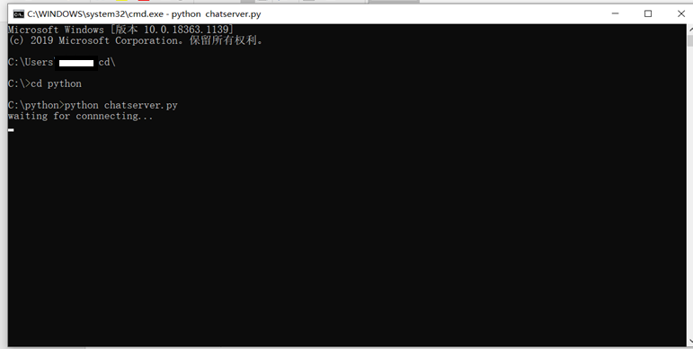
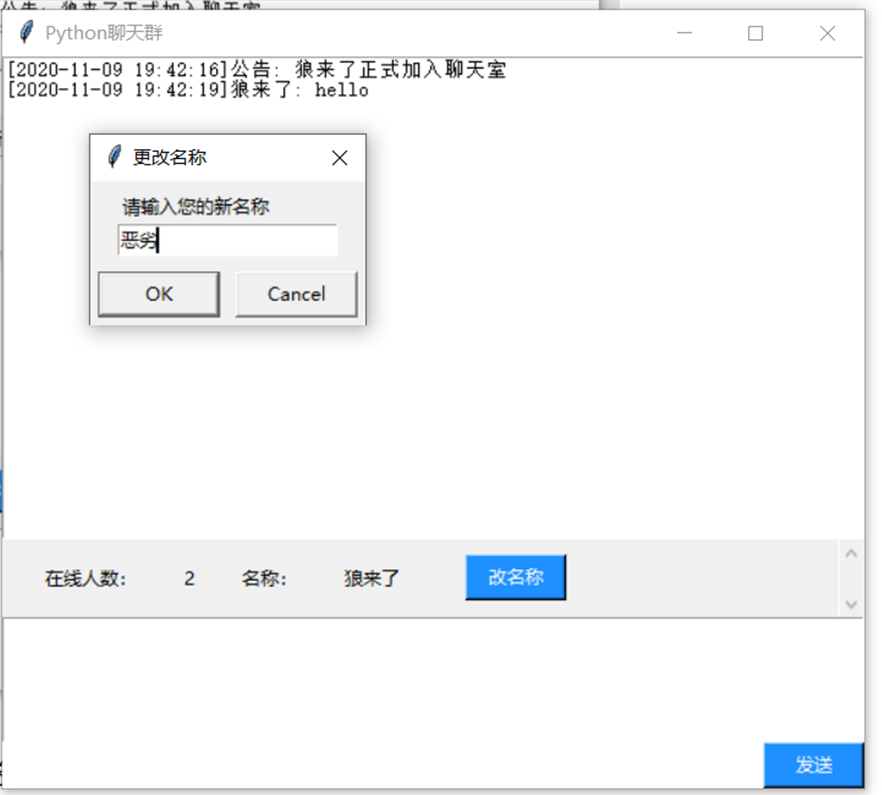
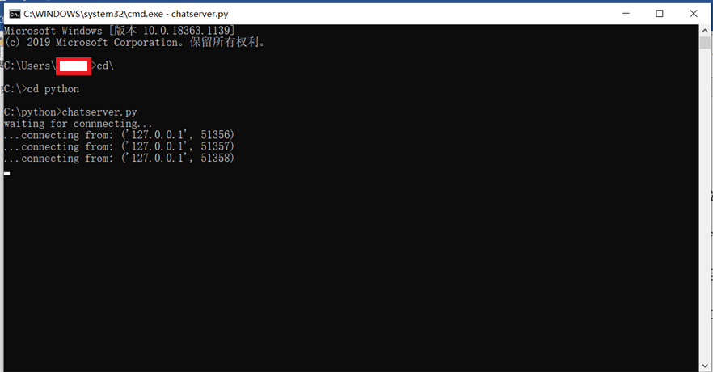

# Chat-room-based-on-Python-implementation
该程序是一个聊天室程序，它是通过python语言编写的，主要有两个程序——客户端程序和服务端程序，这两个程序的类型都是python的基本文件格式.py，可以通过文本编辑器（比如visual studio code）来查看源代码，要运行这两个程序的话，可以使用命令行终端、jupyter notebook和pycharm等来运行.py文件（前两个一定要装有python3以上的版本及安装好相关的库文件）。
***
服务端程序为客户端程序提供服务，没有图形界面，负责监听有无新的连接和把用户发来的信息广播给全体用户。客户端程序是每个用户发信息和接收其他用户信息的主体程序，拥有图形界面，文本框用于显示所有用户发出的信息、用户名称及发送时间，文本框已被绑定，无法修改里面的文字。每个用户正式加入聊天时一定要输入名称才能发送信息，用户在输入名称后客户端程序会发出公告告诉全体该用户已正式加入聊天室，公告里会显示刚加入的该用户的名称。用户可以在客户端程序中可以看出有多少个用户（包括服务器）在使用客户端程序及自己的名称，同时，客户端程序有两个功能按键，一个是发送键，点击后就会发送发送框里的·信息，同时清空发送框的文字；一个是更改名称的按键，用户可以随时通过这个按键更改名称，但是不能是‘公告’，因为这已经被客户端程序使用——用来发出公告。
***
**程序代码、注释及注意事项：**
	一定要先运行服务端程序，再来运行客户端程序，这样聊天室程序才能正常工作，而且一定要先把所有用户的客户端程序关闭后再来关闭服务端程序，若将聊天室先于客户端程序关闭，那么一定要关闭所有客户端之后然后再打开服务端才能再次打开客户端程序并使客户端正常运行。
调试使用的程序：
                命令行程序（python版本3.85）
                Jupyter notebook(python 版本3.85)
***
**若无法查看到图片则是网络的问题，或者下载pdf观看**
***
python实现socket通讯原理：

实现细节和运行效果：
   具体的细节请查看源代码，里面有很详细的注释。
## 先在本机上同时运行客户端和服务端：
	使用命令行程序cd指令打开两个程序的结果：
### 1.服务器：

### 2.客户端：

2.1.未更改名称前，无法得知在线人数和用户名称，并且发送信息则会提示输入新名称，没有完成输入名称，就无法发送信息，而且弹出更改名称窗口后，无法操纵主窗口，除非子窗口消失：

2.2.输入名称后客户端会发出公告，此时也能显示聊天室里有多少人（包括服务器）和自己的名称，只要有人发信息或者客户端发出公告，在线人数的实时状态就会更新：

2.3.输入名称（只需输入一次）后点击输入信息并点击发送按键就可以发送信息，发送完信息后发送框里的文本会被清除掉（借助于tk模块的delete方法）：

2.4.点击改名称按键会弹出窗口：

点击ok后再发送信息，用户名称已经更改：

2.5.若想更改名称为‘公告’（必定无法成功），则会：

2.6.启动三个客户端程序和一个服务器程序，并且随意输入信息，效果如下（只截了其中两个窗口的图）：

可以看见，此时在线人数变为4,（包括服务器），信息滑动条因为输入的信息总量已超过一个窗口所能展示的上限所以被激活，可以滑动滑动条（滑动鼠标或拉动滑动条）来查看信息（上图的左边窗口和右边窗口显示的信息不完全相同是因为滑动条处于的位置不同所导致的）。
2.7.此时可在服务器程序中查看有哪些申请连接的套接字：

2.8.点击退出图标（即窗口右上角），会提示是否退出：

关闭其中两个窗口，效果如下：

可以发现，客户端会在用户退出后发出公告，告诉全体用户刚才退出的用户的名称，此时在线人数变成了2（原先有4个，退出了两个）。
## 在不同主机上实现通信
如果要实现电脑间通信, 需先获得运行服务端代码的电脑的ip地址(linux下可通过 ifconfig 命令查看), 然后将客户端代码的HOST改为服务端的ip地址即可，但所有电脑必须处于同一局域网（可以借助路由器）,否则的话就得借助云服务器实现处于不同局域网下的Socket通信。
> 原理：拥有一台有公网IP的云服务器作为中转站，将局域网下的电脑将数据信息发送给中转的服务器，然后这个中转的服务器将收到的数据转给另外一台电脑，这样就可以实现两台电脑之间的互相通信。
原因：我们可以实现在局域网下的通信而不能在不是同一局域网下的通信是因为，不同的私网之间是无法通信的，但是所有的私网却都可以和公网ip直接通信的。所以。想要在两个私网之间通信的话，我们就需要多一个步骤，也就是需要一个公网的IP作为中转站。
